# A Step-by-Step Guide:   Deploying Website & Custom Domain

Website: [Mesel Ghea Personal Site](https://meselghea.site/)

## Deploying Website on netlify

### Step 1: Login to your [Netlify](https://app.netlify.com/)

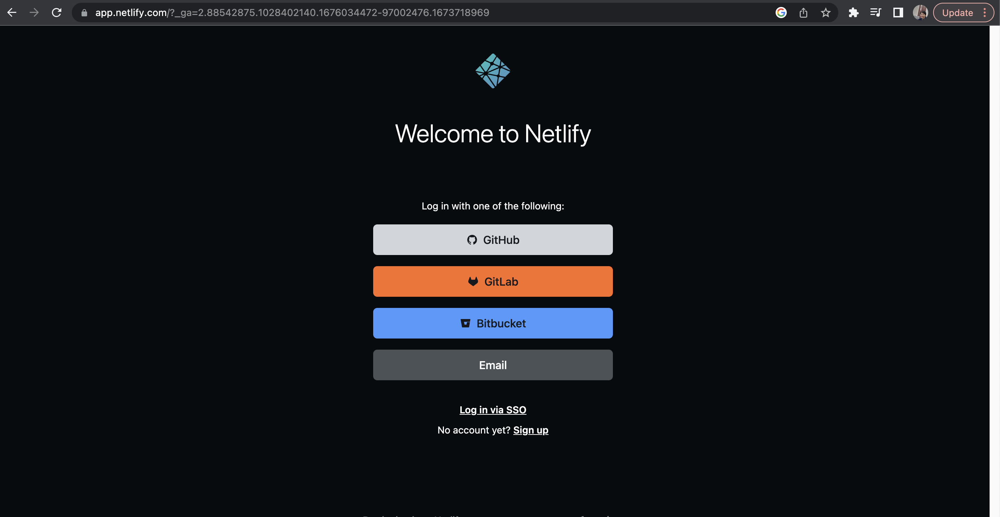

#### Step 2: Click menu " site "

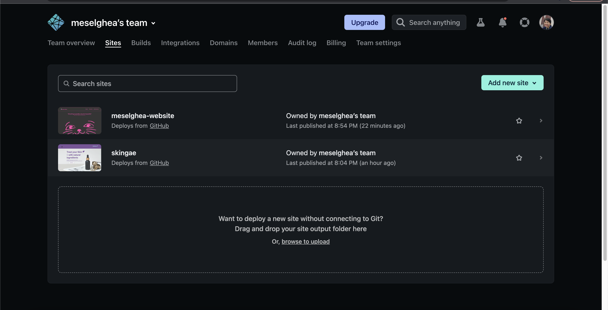

### Step 3: Click " Add New Site " > " Import an existing project "

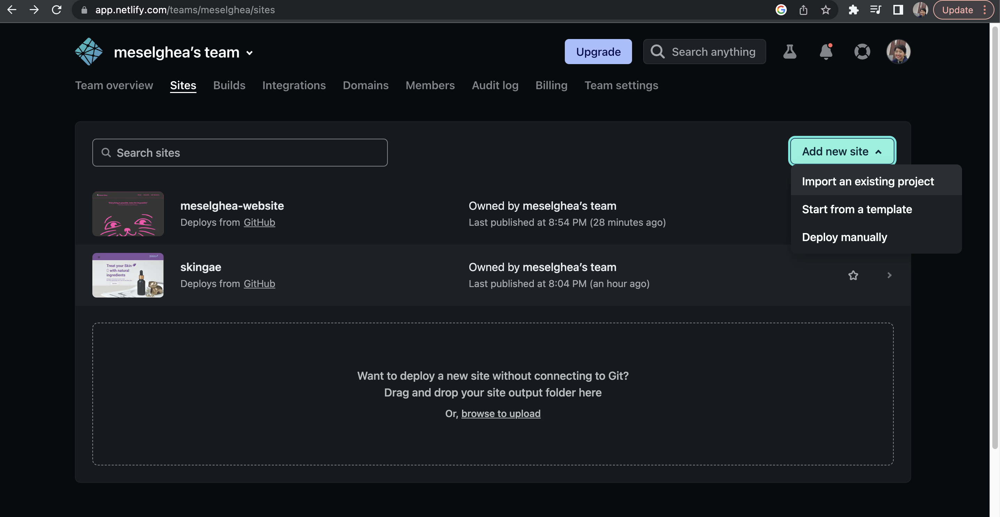

### Step 4: Connect to Git provider & pick a your respository

### Step 6: Skip the basic build settings & click " deploy site "

If you’re not using a static site generator or build you skip

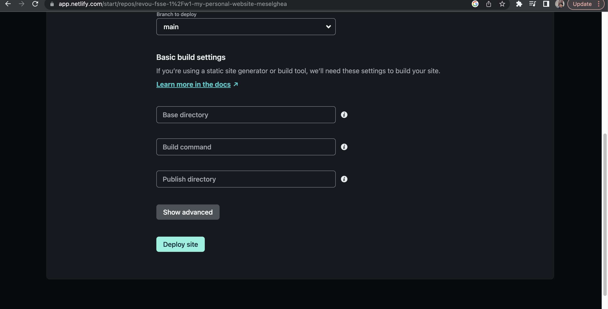

## Connect to domain and DNS

### Step 1: Purchase a domain from a hosting provider

Hosting Provider: [Niagahoster](https://www.niagahoster.co.id/), [Hostinger](https://www.hostinger.co.id/), [Domainesia](https://www.domainesia.com/)

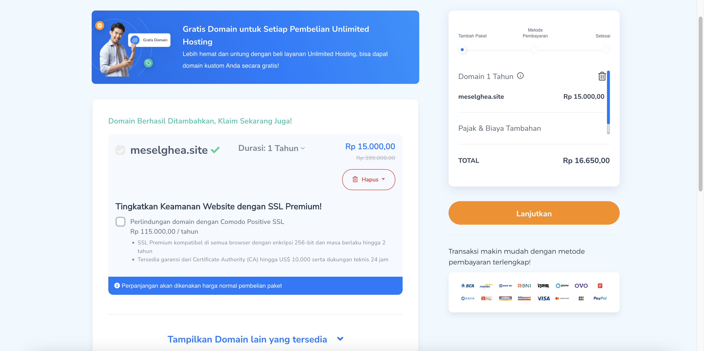

### Step 2: Setting DNS with Cloudflare

- Login to your [cloudframe](https://dash.cloudflare.com/login)
  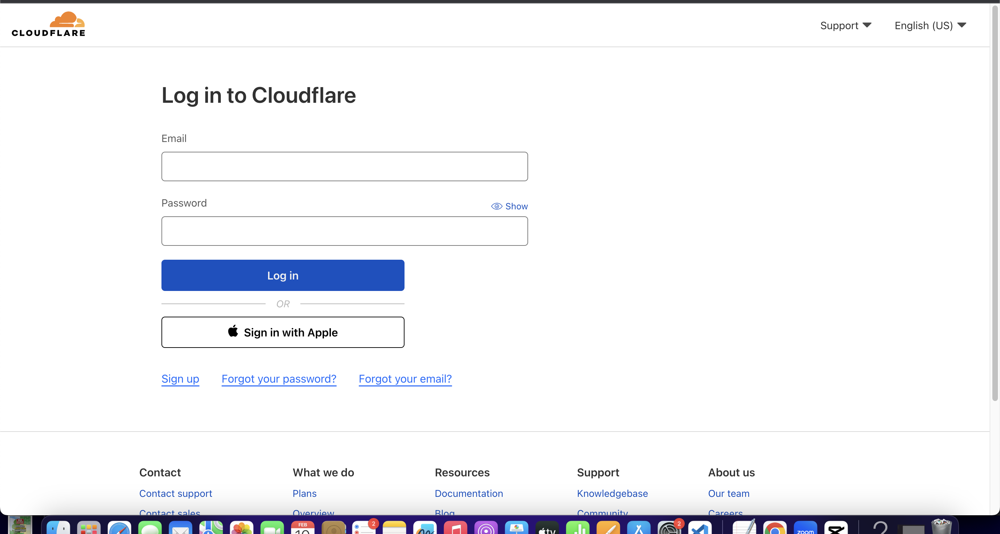
- Click Websites > add a site > input your custom domain
  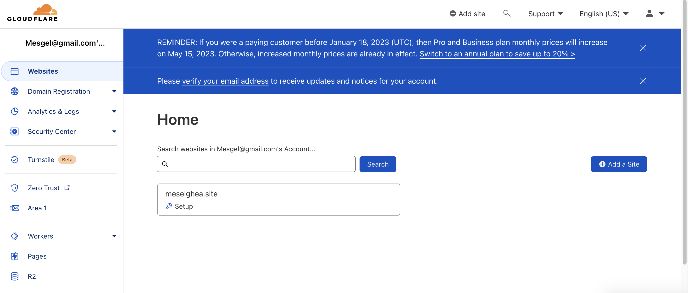
- Copy cloudflare nameservers to provider hosting
  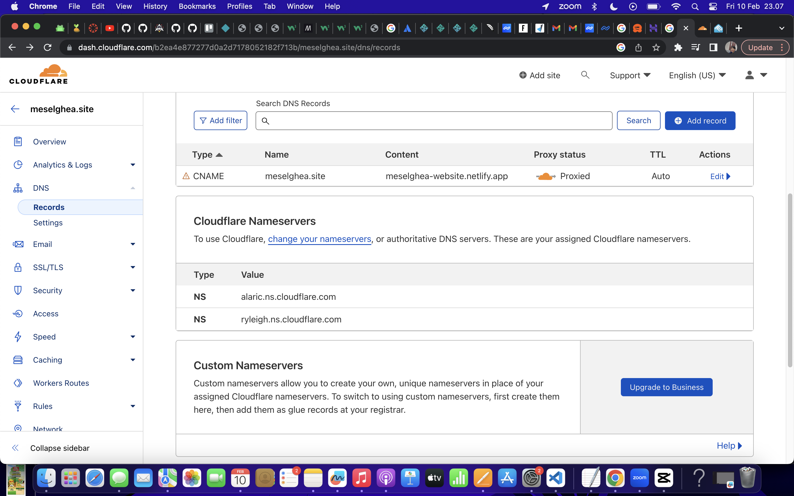
  If you use Niagahoster, go to "Kelola Layanan" > Overview Domain > "Ubah Nameserver"
  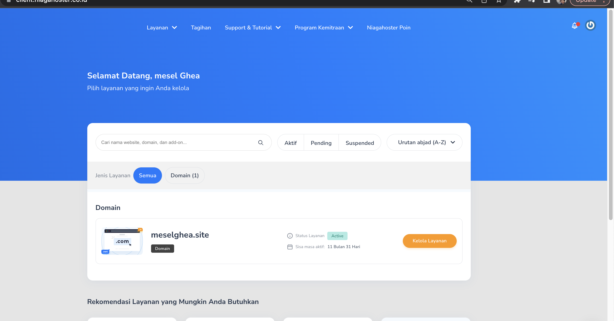
  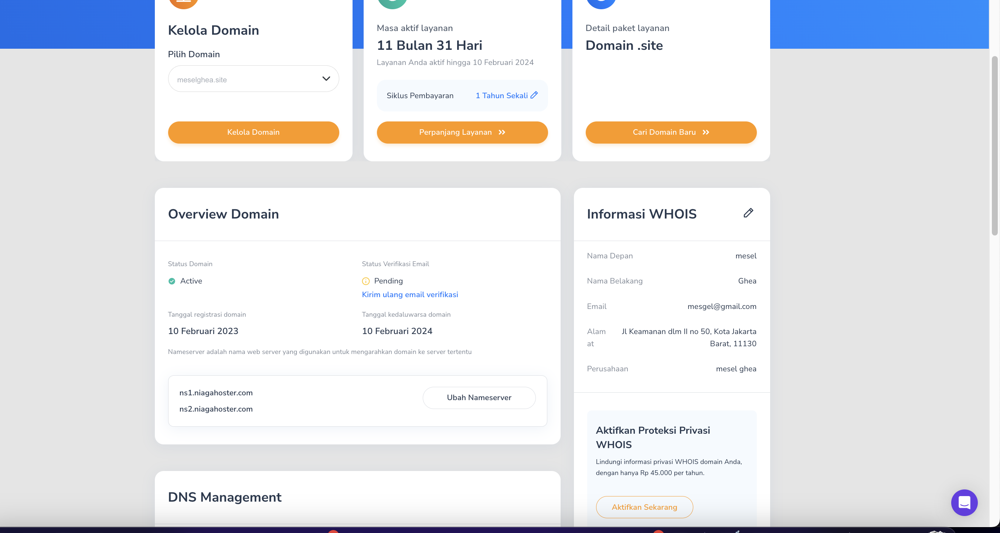
  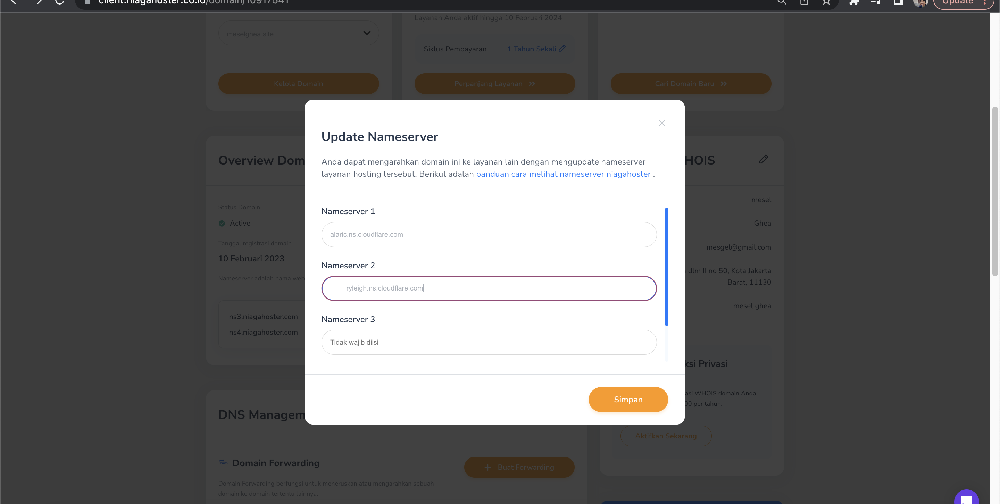
- Setting CNAME on Cloudflare,
  click DNS > Records > Add Record > change type A to CNNAME > copy custom domain at column name > copy Netfliy site to content
  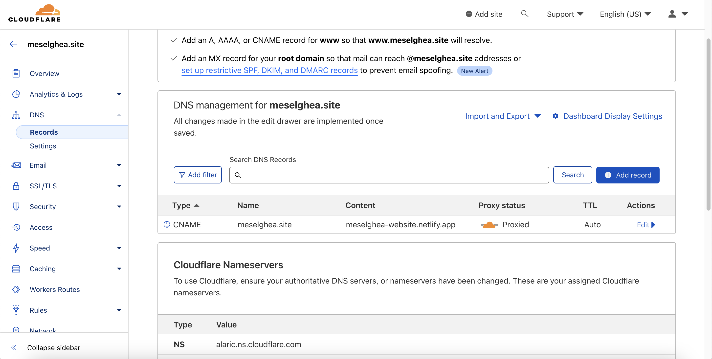

### Step 3: Add Custom Domain to Netlify

- Open Netlify, click domain Setting
  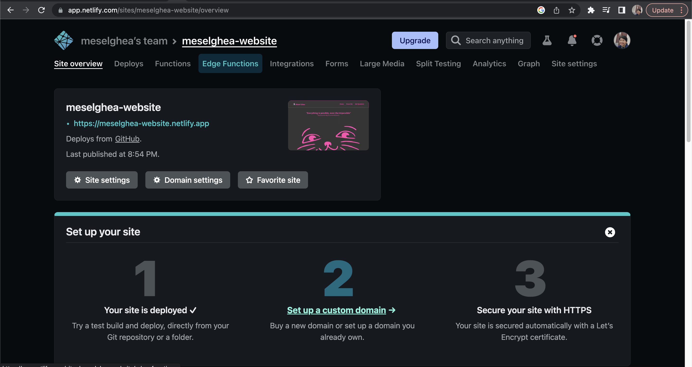
- Scroll down > click Add a Domain > copy your custom domain
  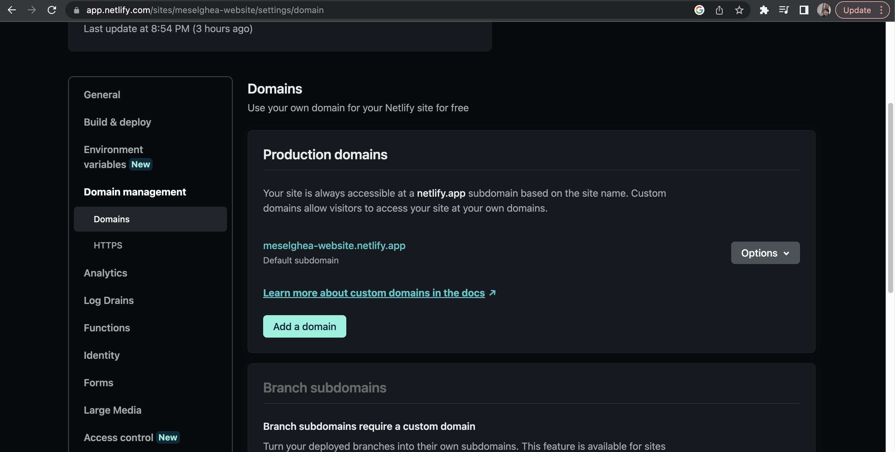
